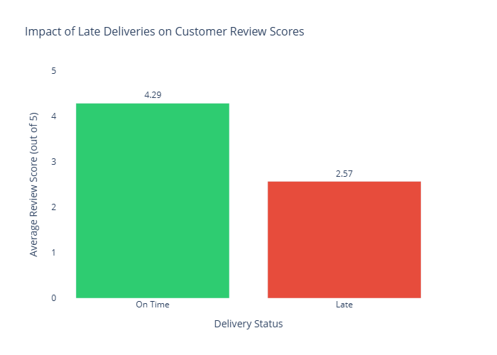
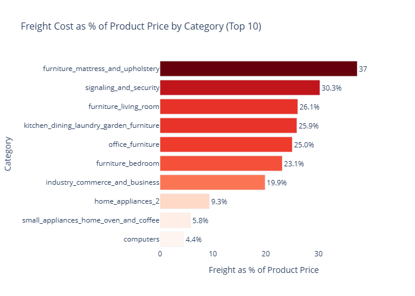
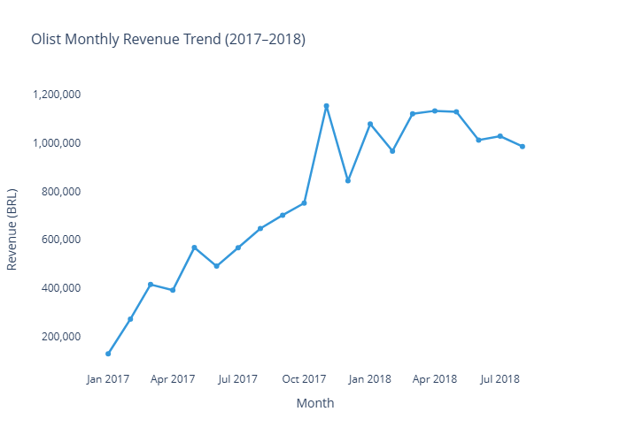

---

## What is this project about?

I picked up the Olist Brazilian E-Commerce dataset — 100,000+ real orders from Brazil's largest marketplace — and ran a full analysis on it from scratch. That means I built the database, cleaned the data, wrote the SQL, and built the charts myself.

I wasn't trying to just practice SQL. I wanted to answer real business questions — the kind a company actually needs answered:

- Why are customers leaving bad reviews?
- Which product categories are eating into profit margins?
- Is the business actually growing, and when did it start?

Here's what I found.

---

## The Three Findings That Matter

### 1. Late deliveries are destroying customer trust

This one surprised me with how clear-cut it was.

| Delivery Status | Avg Review Score | Orders |
|----------------|-----------------|--------|
| ✅ On Time | 4.29 / 5 | 88,653 |
| ❌ Late | 2.57 / 5 | 7,700 |

A **40% drop in review scores** just from being late. Not product quality. Not price. Just delivery timing.

7,700 orders were late. That's 8% of all delivered orders leaving reviews that look like this — and those reviews are public, permanent, and hurting future sales.



---

### 2. The furniture category has a serious logistics problem

When I looked at freight cost as a percentage of product price across categories, furniture stood out immediately.

| Category | Avg Freight | Avg Price | Freight % |
|----------|------------|-----------|-----------|
| furniture_mattress_and_upholstery | R$42.91 | R$114.95 | **37.33%** |
| home_appliances_2 | R$44.54 | R$476.12 | 9.35% |
| computers | R$48.45 | R$1,098.34 | 4.41% |

Computers actually cost more to ship in absolute terms — but at 4.4% of product price, it barely matters. Furniture at **37%** is a different problem entirely. For every R$100 sofa sold, R$37 is going to the courier.



---

### 3. Olist grew explosively — then stabilised

The revenue chart tells a clear story: Olist went from a small player to serious scale between early 2017 and late 2017, then stabilised around the R$1M/month mark through 2018.

That November 2017 spike? That's Black Friday in Brazil. Revenue hit R$1.15M that month — the highest point in the dataset.



---

## What should Olist actually do about this?

**On delivery performance:**
Fix the SLA first. A 40% satisfaction drop is not a marginal issue — it's a structural one. Olist should flag at-risk orders early, communicate proactively with customers when delays happen, and hold logistics partners accountable with performance data exactly like this.

**On furniture margins:**
At 37% freight-to-price, furniture is barely worth selling at current logistics rates. The options are: negotiate bulk contracts with freight partners, set minimum order values for furniture categories, or work with specialised furniture delivery services that handle bulky items more efficiently.

**On the revenue plateau:**
The jump from R$127K to R$1M+ monthly in under a year is impressive. But understanding *what* drove the October–November 2017 spike — whether it was a campaign, a new seller category, or seasonal demand — would directly inform how to replicate that growth.

---

## How I built this

### The data

The Olist dataset comes as 9 separate CSV files that need to be joined together. It covers real orders, real customers, real sellers, and real reviews from 2016 to 2018.

| | |
|---|---|
| **Source** | [Kaggle — Olist Brazilian E-Commerce](https://www.kaggle.com/datasets/olistbr/brazilian-ecommerce) |
| **Orders** | 99,441 |
| **Order items** | 112,650 |
| **Period** | September 2016 — October 2018 |
| **Tables** | 9 relational tables |

### The database schema

```
orders ──── customers
  │
  ├──── order_items ──── products ──── category
  │
  ├──── payments
  │
  ├──── reviews
  │
  └──── sellers
             │
         geolocation
```

One thing worth noting on schema design — not every table gets a single-column primary key. `order_items` and `payments` both needed composite keys because one order can have multiple items and multiple payments. That's a design decision that took some debugging to get right.

### The tools

| Tool | What I used it for |
|------|--------------------|
| PostgreSQL 18 | Database — schema design, import, all SQL queries |
| pgAdmin 4 | Query execution and result export |
| Python 3.13 + Pandas | Data cleaning — nulls, type fixes, feature engineering |
| Plotly | All three charts |
| VS Code | Writing and running everything |

---

## The SQL questions I answered

| # | Question | What I found |
|---|----------|-------------|
| 1 | How many orders exist? | 99,441 total orders |
| 2 | Order status breakdown? | 97% delivered successfully |
| 3 | Total platform revenue? | R$16M+ across all orders |
| 4 | Which cities have most customers? | São Paulo (15,540), Rio de Janeiro (6,882) |
| 5 | Top product categories by orders? | Bed/Bath, Health/Beauty, Sports |
| 6 | Average monthly delivery variance? | Significant seasonal variation |
| 7 | Monthly revenue trend? | 4.4x growth from Jan to May 2017 |
| 8 | High revenue sellers with bad reviews? | Top 10 high-risk sellers identified |
| 9 | Highest freight cost categories? | Furniture at 37.33% freight ratio |
| 10 | Do late deliveries hurt review scores? | Yes — 40% drop, 4.29 → 2.57 |

---

## How to run this yourself

**You'll need:** PostgreSQL 18, Python 3.x, pgAdmin 4

```bash
# 1. Clone the repo
git clone https://github.com/yourusername/olist-ecommerce-sql-analysis

# 2. Download the 9 Olist CSVs from Kaggle and import into PostgreSQL
# Create database: CREATE DATABASE olist_db;
# Import via pgAdmin Import/Export tool

# 3. Run the SQL analysis
# Open sql/analysis_queries.sql in pgAdmin and execute

# 4. Install Python dependencies
pip install pandas plotly kaleido

# 5. Generate the charts
python visualizations.py
```

---

## Project files

```
olist-ecommerce-sql-analysis/
│
├── README.md
├── visualizations.py
│
├── sql/
│   └── analysis_queries.sql
│
├── results/
│   ├── delivery_vs_reviews.csv
│   ├── monthly_revenue.csv
│   └── freight_by_category.csv
│
└── visuals/
    ├── delivery_vs_reviews.png
    ├── monthly_revenue.png
    ├── freight_by_category.png
    ├── delivery_vs_reviews.html
    ├── monthly_revenue.html
    └── freight_by_category.html
```

---

## About me

I'm Tushar — a BCA graduate based in Delhi NCR, currently building my data analyst portfolio. This is my first end-to-end project and I built everything in it from scratch.

**Skills:** SQL · PostgreSQL · Python · Pandas · Plotly · Scikit-learn · PowerBI · Excel

📎 [LinkedIn](https://www.linkedin.com/in/tusharpassinate) · [GitHub](https://github.com/Tusharg5600)

---

*Dataset: Olist via Kaggle (CC BY-NC-SA 4.0)*
